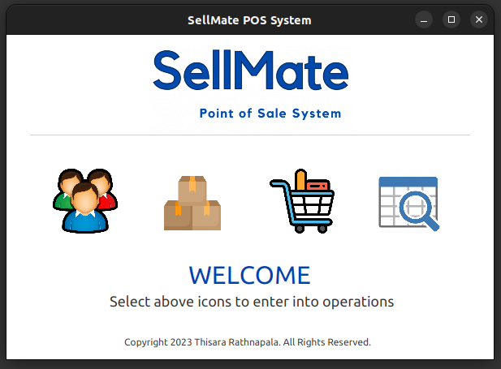
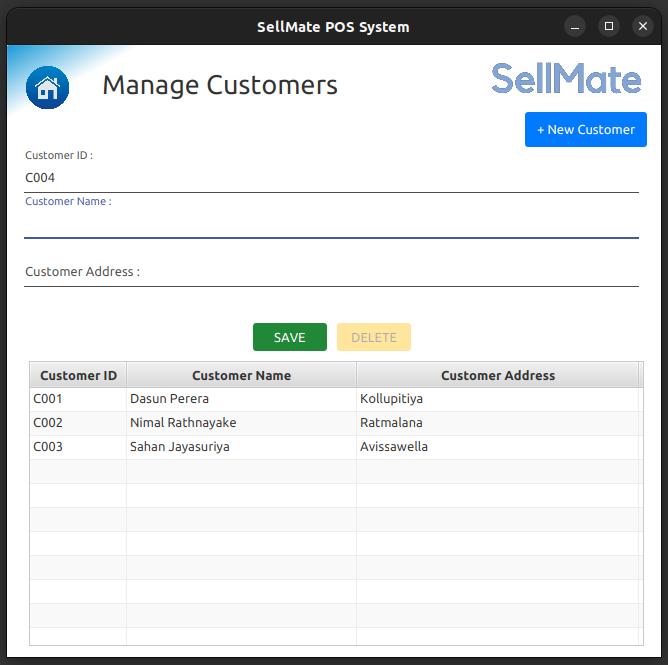
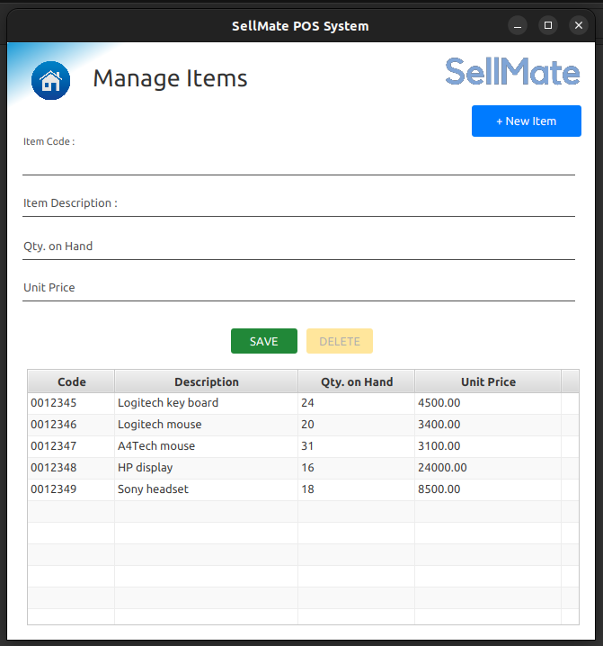

# SellMate Point of Sale System (POS) 


All-In-One Point of Sale Software: Elevate Your Sales Experience

## Overview

Welcome to the Point of Sale (POS) System repository! This project serves as a showcase of coding abilities and is open for contributions from the community. Built using JavaFX, PostgreSQL, JDBC, and Jaspersoft Studio, this POS system provides a comprehensive solution for managing transactions, inventory, and customer relations. This project serves as a showcase of coding abilities and is open for contributions from the community.

## Project Preview

### Dashboard


### Customer Management


### Inventory Management


### Place Order


### Search Orders


### POS Bill


## Features

- **Efficient Transactions:** Streamline the sales process with quick and error-free transaction handling. 

- **Inventory Management:** Take control of your inventory with real-time tracking.

- **Customer Relations:** Enhance customer service with detailed customer profiles and purchase history.

- **User-Friendly Interface:** Designed with ease of use in mind, our software ensures a short learning curve for your staff.

- **Customization:** Tailor the system to your business needs, whether you're a retail store, restaurant, or service provider.

- **POS Bill:** Auto generating POS Bill that can customize the way you want.


## Requirements

- Java Development Kit (JDK)
- JavaFX
- PostgreSQL
- JDBC
- Jaspersoft Studio

## Installation

1. **Clone the Repository:**
   ```bash
   git clone https://github.com/thisaratr94/sellmate-pos-system.git
   cd pos-system

2. **Database Setup:**
    Create a PostgreSQL database and configure the connection details in the src/main/resources/application.properties file.

3. **Build and Run:**
    Open the project in your preferred Java IDE.
    Build and run the application.


## Usage

1. **Navigate:**

    Explore the intuitive user interface to manage transactions, monitor inventory, and access customer information.

2. **Generate Bills:**

    Utilize Jaspersoft Studio for bill generation. Ensure that the necessary templates are configured and available.


## Version
1.0.0

## License
copyright &copy; 2023 Thisara Rathnapala. All Rights Reserved. <br>
This project is licensed under the [MIT License](License.txt)

Thank you for exploring our Point of Sale System! We appreciate your interest in our showcase project.
